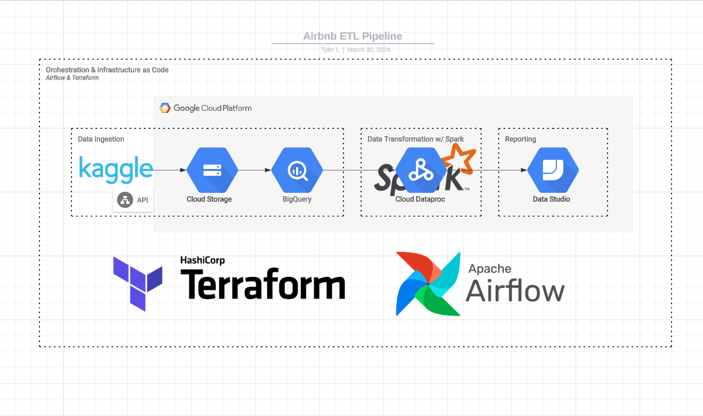

# NYC Airbnb ETL Pipeline - Data Engineering Project
This repo contains the final project implemented for the [Data Engineering zoomcamp](https://github.com/DataTalksClub/data-engineering-zoomcamp) course.

## Introduction

Airbnbs are one of the best ways to house a group of people when traveling when you have to account for more than two people. This project aims to develop a workflow to ingest and process Airbnb data to help my group of friends and I who are traveling to New York soon to find the best area to book a full Entire room/apt since we are traveling as a large group.

## Dataset
The [New York City Airbnb dataset](https://www.kaggle.com/datasets/dgomonov/new-york-city-airbnb-open-data) is used. This dataset is being pulled utilizing the [Kaggle API](https://www.kaggle.com/docs/api)

Each row represents a different listing. They include the area by their coordinates and borough with included review and price information.

## Tools

The following components were utilized to implement the required solution:
* Data Ingestion: [Kaggle API](https://www.kaggle.com/docs/api)
* Infrastructure as Code: Terraform
* Workflow Management: Airflow
* Data Lake: Google Cloud Storage
* Data Warehouse: Google BigQuery
* Data Transformation: Spark via Google Dataproc
* Reporting: Google Data Studio

### Architecture


## Steps to Reproduce

### Local setup
* Install the below tools:
  * [Terraform](https://www.terraform.io/downloads)
  * [Google Cloud SDK](https://cloud.google.com/sdk/docs/install-sdk#deb)
  * docker + docker-compose v2

### Cloud setup
* In GCP, create a service principal with the following permissions:
  * BigQuery Admin
  * Storage Admin
  * Storage Object Admin
  * Dataproc Admin
* Download the service principal authentication file and save it in the airflow & terraform folders.
* Download your Kaggle API key as well into the .kaggle folder
* The image below shows where the credential files should be located. .google/credentials/google_credentials.json
  * ($HOME)/airflow/.google/credentials/google_credentials.json (Google Credentials)
  * ($HOME)/airflow/.kaggle/kaggle.json (Kaggle Credentials)
  * ($HOME)/terraform/credentials/my-creds.json (Google Credentials)
* 

* Ensure that the following APIs are enabled:
  * Compute Engine API
  * Cloud Dataproc API
  * Cloud Dataproc Control API
  * BigQuery API
  * Bigquery Storage API
  * Identity and Access Management (IAM) API
  * IAM Service Account Credentials API

### Initializing Infrastructure (Terraform)

* Perform the following to set up the required cloud infrastructure
```shell
cd terraform
terraform init
terraform plan
terraform apply

cd ..
```

### Data Ingestion & Transformation

* Setup airflow to perform data ingestion
```shell
cd airflow

docker-compose build
docker-compose up airflow-init
docker-compose up -d
```

* Go to the airflow UI at the web address `localhost:8080` and enable the `data_airbnb_dag`. 
* This dag will:
  * Ingest the data from the Kaggle API
  * Import the Airbnb data to the Google Cloud Storage
  * Transfer the data file from Google Cloud Storage into BigQuery
  * Create a Dataproc cluster and submit spark job to perform the transformation on BigQuery data
  * Transfer transformed data as a new table into BigQuery


### Reporting

Our conclusions for NYC Airbnbs is out of the 48000 listings provided we see that Brooklyn is close enough to our required location and has a lower average price for entire home/apt rentals than Manhattan.
We even take it one step farther to find that Mill Basin has the lowest average price in Brooklyn for entire home/apt rentals so we will be looking specifically in that area for the best prices.


It can also be viewed at this [link](https://lookerstudio.google.com/s/mEDNfaDKFc0).
